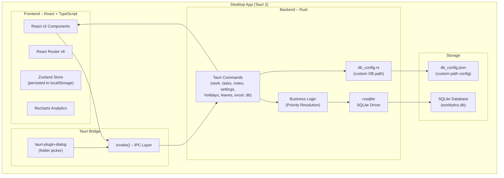
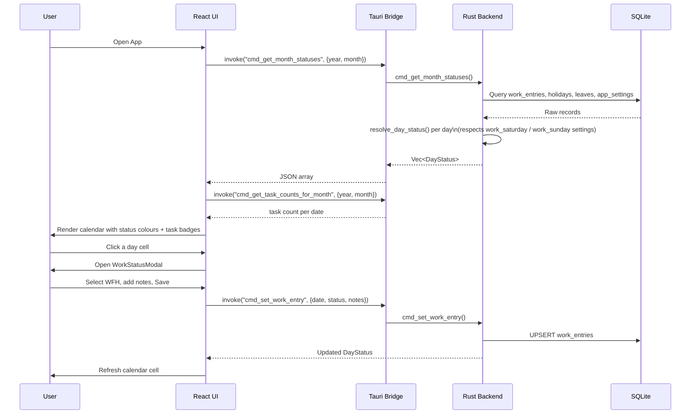
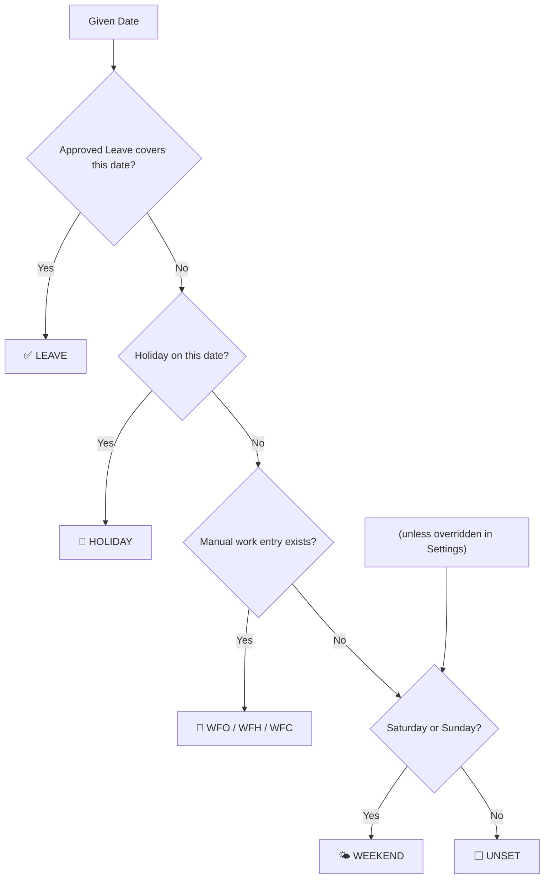
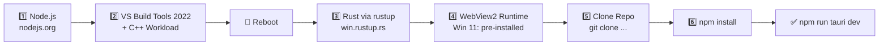
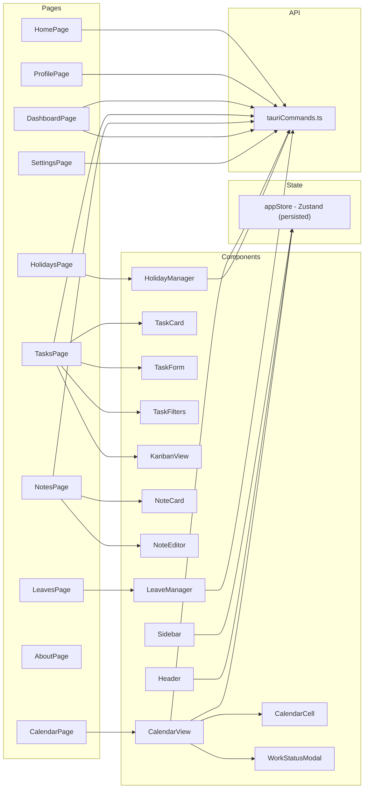

# Worklytics

> **Daily Work Status & Productivity Tracker** — A cross-platform offline-first desktop application built with React, Rust, Tauri, and SQLite.

Track your daily work mode (WFO, WFH, WFC), manage holidays and leaves, log daily tasks, jot sticky notes, auto-detect weekends, and visualise monthly/yearly analytics — all stored locally with zero cloud dependency.

---

## Table of Contents

1. [Features](#features)
2. [Tech Stack](#tech-stack)
3. [Architecture Overview](#architecture-overview)
4. [Database Schema](#database-schema)
5. [Application Flow](#application-flow)
6. [Status Priority Rules](#status-priority-rules)
7. [Folder Structure](#folder-structure)
8. [Prerequisites & Installation (Step-by-Step)](#prerequisites--installation-step-by-step)
9. [Project Setup](#project-setup)
10. [Running in Development](#running-in-development)
11. [Building the Windows EXE](#building-the-windows-exe)
12. [UI Overview](#ui-overview)
13. [Tauri Commands Reference](#tauri-commands-reference)
14. [Export Feature](#export-feature)
15. [License](#license)

---

## Features

### Core Work Tracking

| Feature | Description |
|---|---|
| 📅 **Calendar View** | Interactive monthly calendar with colour-coded work statuses and task count indicators |
| 🏢 **WFO / 🏠 WFH / 🏗️ WFC** | Mark each workday with your work location |
| 🎉 **Holiday Manager** | Add, edit, delete holidays; supports recurring yearly holidays |
| 🏖️ **Leave Manager** | Track leaves by type (Casual, Sick, Earned, etc.) and approval status |
| 📆 **Weekend Auto-detection** | Saturday & Sunday are automatically marked as Weekend |
| ⚙️ **Weekend Work Override** | Optionally configure Saturday and/or Sunday as working days |
| ⚖️ **Priority Rules** | Leave > Holiday > Work Mode > Weekend > Unset |

### Productivity

| Feature | Description |
|---|---|
| 🏠 **Home Dashboard** | Quick-glance summary — stats cards, mini calendar strip, recent tasks and notes |
| ✅ **Daily Tasks** | Log task updates with title, details, notes, tags, sprint, project, team, and time spent |
| 🗂️ **Kanban Board** | Toggle between List and Kanban views; columns for TODO, In Progress, Blocked, Completed + custom statuses; click any card to open a slide-in **detail drawer** with full task info |
| 🗒️ **Sticky Notes** | Coloured sticky notes (yellow, blue, green, pink, purple) with pin, search, and filter |
| 📊 **Analytics Dashboard** | Monthly/yearly charts — bar, area, and pie charts with configurable year range |
| 📤 **CSV Export** | Export monthly or yearly work-status data to CSV |
| 📊 **Excel Export** | Export work statuses and tasks to a formatted `.xlsx` workbook |

### Settings & Customisation

| Feature | Description |
|---|---|
| 🌙 **Dark / Light / System Theme** | Per-app theme toggle; system preference auto-detected |
| 🕐 **Real-time Clock** | Live clock with timezone abbreviation displayed in the header |
| 🌍 **Timezone Selector** | Choose display timezone for the header clock |
| 📅 **Configurable Year Range** | Set the calendar/analytics year range (e.g. 2020–2050) |
| 🗄️ **Custom DB Location** | Choose where the SQLite database is stored; one-click migration |
| 🗂️ **Collapsible Sidebar** | Sidebar collapses to icon-only mode to maximise screen space |
| 🏷️ **Custom Task Statuses** | Define extra task statuses beyond the four built-in ones |
| 🗃️ **Task Metadata** | Configure sprint, project, and team lists used as task dropdowns |
| 🎨 **Accent Colour** | Choose from six accent colour palettes (indigo, blue, violet, emerald, rose, amber); colour change applies **live** across the entire UI instantly |
| 👤 **User Profile** | Set your Display Name, Email, and Role; stored in SQLite; shown in sidebar, header avatar, and personalised home greeting |
| 🧑‍💻 **Developer Info** | Configurable "Developed By" section in the About page (name, email, GitHub handle) |
| 💾 **Offline-First** | All data lives in a local SQLite database — no internet required |
| 🪟 **Windows EXE** | Packages as a native Windows installer (NSIS + WiX MSI) |

---

## Tech Stack

| Layer | Technology |
|---|---|
| Frontend UI | React 18 + TypeScript |
| Styling | Tailwind CSS v3 (dark mode via `class` strategy) |
| Charts | Recharts |
| State | Zustand v5 (with `persist` middleware) |
| Routing | React Router v6 |
| Desktop Runtime | Tauri 2 |
| Backend Logic | Rust |
| Database | SQLite (bundled via `rusqlite`) |
| Excel Export | SheetJS (`xlsx`) |
| Date Utilities | date-fns v3 |
| Icons | Lucide React |
| Notifications | React Hot Toast |
| Build | Vite 5 |

---

## Architecture Overview



---

## Database Schema

```mermaid
erDiagram
    WORK_ENTRIES {
        INTEGER id PK
        TEXT    date        "YYYY-MM-DD (UNIQUE)"
        TEXT    status      "WFO | WFH | WFC"
        TEXT    notes
        TEXT    created_at
        TEXT    updated_at
    }

    HOLIDAYS {
        INTEGER id PK
        TEXT    name
        TEXT    date        "YYYY-MM-DD (UNIQUE)"
        TEXT    description
        INTEGER is_recurring "0 = one-time, 1 = yearly"
        TEXT    created_at
        TEXT    updated_at
    }

    LEAVES {
        INTEGER id PK
        TEXT    start_date  "YYYY-MM-DD"
        TEXT    end_date    "YYYY-MM-DD"
        TEXT    leave_type  "CASUAL|SICK|EARNED|..."
        TEXT    reason
        TEXT    status      "PENDING|APPROVED|REJECTED"
        TEXT    created_at
        TEXT    updated_at
    }

    TASKS {
        INTEGER id PK
        TEXT    date        "YYYY-MM-DD"
        TEXT    title
        TEXT    details
        TEXT    notes
        TEXT    status      "TODO|IN_PROGRESS|COMPLETED|BLOCKED|<custom>"
        TEXT    tags        "sprint:X|project:Y|team:Z|tag1,tag2,..."
        REAL    time_spent  "hours"
        TEXT    created_at
        TEXT    updated_at
    }

    STICKY_NOTES {
        INTEGER id PK
        TEXT    title
        TEXT    content
        TEXT    color       "yellow|blue|green|pink|purple"
        INTEGER pinned      "0 or 1"
        TEXT    created_at
        TEXT    updated_at
    }

    APP_SETTINGS {
        TEXT    key   PK
        TEXT    value
    }

> **Note:** The `tasks.tags` column encodes structured metadata using pipe-separated key:value prefixes — e.g. `sprint:Q2-2025|project:Alpha|team:Backend|bug,urgent`. The `status` column accepts any string; built-in values are `TODO`, `IN_PROGRESS`, `COMPLETED`, `BLOCKED`. Custom statuses defined in Settings are also valid.
```

---

## Application Flow



---

## Status Priority Rules



**Priority order:** `LEAVE` > `HOLIDAY` > `WFO/WFH/WFC` > `WEEKEND` > `UNSET`

> Weekend detection respects the **"Mark Saturdays/Sundays as working days"** toggles in Settings.

---

## Folder Structure

```
worklytics/
├── src/                                  # React frontend
│   ├── components/
│   │   ├── calendar/
│   │   │   ├── CalendarView.tsx          # Main calendar grid (month/year dropdowns, task counts)
│   │   │   ├── CalendarCell.tsx          # Individual day cell (status colour + task badge)
│   │   │   └── WorkStatusModal.tsx       # Status picker modal
│   │   ├── dashboard/
│   │   │   ├── StatsCard.tsx             # KPI summary card
│   │   │   ├── MonthlyChart.tsx          # Stacked bar chart
│   │   │   ├── YearlyTrendChart.tsx      # Area trend chart
│   │   │   └── StatusDistributionChart.tsx
│   │   ├── tasks/
│   │   │   ├── TaskCard.tsx              # Expandable task card (sprint/project/team chips, dynamic status colour, onSelect for Kanban)
│   │   │   ├── TaskForm.tsx              # Add/edit task modal (sprint/project/team dropdowns, custom statuses)
│   │   │   ├── TaskFilters.tsx           # Search, status, tag, sprint, project, team, date-range filters
│   │   │   └── KanbanView.tsx            # Kanban board with dynamic columns + slide-in task detail drawer
│   │   ├── notes/
│   │   │   ├── NoteCard.tsx              # Coloured sticky note card
│   │   │   └── NoteEditor.tsx            # Create/edit note modal
│   │   ├── holidays/
│   │   │   ├── HolidayManager.tsx
│   │   │   └── HolidayForm.tsx
│   │   ├── leaves/
│   │   │   ├── LeaveManager.tsx
│   │   │   └── LeaveForm.tsx
│   │   ├── layout/
│   │   │   ├── Layout.tsx                # App shell + dark-mode class injection + profile/settings load from DB on startup
│   │   │   ├── Sidebar.tsx               # Collapsible navigation + bottom profile avatar card
│   │   │   └── Header.tsx                # Real-time clock + theme toggle + user avatar pill (→ /profile)
│   │   └── common/
│   │       ├── Button.tsx
│   │       ├── Modal.tsx
│   │       ├── ConfirmDialog.tsx
│   │       └── StatusBadge.tsx
│   ├── pages/
│   │   ├── HomePage.tsx                  # Enhanced dashboard: greeting, today status, year bar, quick actions, mini calendar, recent tasks/notes
│   │   ├── CalendarPage.tsx
│   │   ├── DashboardPage.tsx             # Includes Excel export
│   │   ├── HolidaysPage.tsx
│   │   ├── LeavesPage.tsx
│   │   ├── TasksPage.tsx                 # Daily task tracking (list + kanban views, sprint/project/team filters)
│   │   ├── NotesPage.tsx                 # Sticky notes
│   │   ├── ProfilePage.tsx               # User profile editor (name, email, role; persisted to SQLite)
│   │   ├── SettingsPage.tsx              # Theme (live accent preview), timezone, year range, weekend, custom statuses, metadata, DB path, About info
│   │   └── AboutPage.tsx                 # App info, "Developed By" section, tech stack, architecture, status priority rules
│   ├── store/
│   │   └── appStore.ts                   # Zustand (persisted: year, month, settings, profile, sidebar, taskViewMode); exports computeInitials(), applyAccentColor()
│   ├── types/
│   │   └── index.ts                      # All TypeScript types + DEFAULT_SETTINGS + UserProfile + DEFAULT_PROFILE
│   ├── utils/
│   │   ├── tauriCommands.ts              # All invoke() wrappers
│   │   ├── dateUtils.ts                  # Date helpers + yearRangeFromBounds + formatDisplayDate
│   │   ├── excelExport.ts                # XLSX workbook builder
│   │   └── cn.ts                         # Tailwind class merger
│   ├── styles/
│   │   └── globals.css                   # Design tokens (--accent-*, --sidebar-*, --bg-*, --text-*), component classes (.wl-card, .wl-btn, .wl-input, sidebar-item), slideFromRight keyframe
│   ├── App.tsx                           # Router setup
│   └── main.tsx                          # React entry point
│
├── src-tauri/                            # Rust/Tauri backend
│   ├── src/
│   │   ├── main.rs
│   │   ├── lib.rs                        # App setup, plugin init, command registration
│   │   ├── error.rs                      # WorklyticsError enum
│   │   ├── db_config.rs                  # Custom DB path config (db_config.json)
│   │   ├── database/
│   │   │   ├── mod.rs                    # DbState + initialize_database()
│   │   │   └── migrations.rs             # All table creation (idempotent)
│   │   ├── models/
│   │   │   ├── mod.rs
│   │   │   ├── holiday.rs
│   │   │   ├── leave.rs
│   │   │   ├── task.rs                   # Task, CreateTask, UpdateTask
│   │   │   ├── note.rs                   # StickyNote, CreateNote, UpdateNote
│   │   │   └── work_entry.rs
│   │   └── commands/
│   │       ├── mod.rs
│   │       ├── holiday_commands.rs
│   │       ├── leave_commands.rs
│   │       ├── work_commands.rs          # resolve_day_status() + weekend settings
│   │       ├── analytics_commands.rs
│   │       ├── export_commands.rs        # CSV export
│   │       ├── excel_commands.rs         # Raw .xlsx bytes writer
│   │       ├── task_commands.rs          # CRUD + task counts for calendar
│   │       ├── note_commands.rs          # CRUD + pin + search for sticky notes
│   │       ├── settings_commands.rs      # app_settings key-value store
│   │       └── db_commands.rs            # DB path get/set/migrate/reset
│   ├── capabilities/
│   │   └── default.json                  # Tauri v2 permissions (dialog:allow-open/save)
│   ├── icons/
│   ├── Cargo.toml
│   ├── build.rs
│   └── tauri.conf.json
│
├── scripts/                              # Build utility scripts (optional)
├── index.html
├── package.json
├── tsconfig.json
├── tsconfig.node.json
├── vite.config.ts
├── tailwind.config.js
├── postcss.config.js
├── .gitignore
└── README.md
```

---

## Prerequisites & Installation (Step-by-Step)

Install the following tools **in the exact order listed below**. Each step must complete successfully before moving to the next.

---

### Step 1 — Node.js (v18 LTS or later)

**Why:** Runs the Vite dev server, npm scripts, and the Tauri CLI frontend build.

| | |
|---|---|
| **Download** | https://nodejs.org/en/download |
| **Recommended** | Node.js 20 LTS (Windows Installer `.msi`) |
| **Verify** | `node --version` → `v20.x.x` |
| **npm included** | `npm --version` → `10.x.x` |

**winget (alternative):**
```powershell
winget install --id OpenJS.NodeJS.LTS -e --accept-source-agreements
```

---

### Step 2 — Visual Studio Build Tools 2022 (C++ Desktop Workload)

**Why:** Rust compiles to native Windows code using the MSVC toolchain. The `link.exe` linker that ships with VS Build Tools is **mandatory** — VS Code alone is NOT sufficient.

| | |
|---|---|
| **Download** | https://visualstudio.microsoft.com/visual-cpp-build-tools/ |
| **Direct installer** | https://aka.ms/vs/17/release/vs_BuildTools.exe |
| **Verify after install** | Open **x64 Native Tools Command Prompt** and run `link` |

**During installation, select exactly this workload:**

```
☑  Desktop development with C++
      ☑  MSVC v143 – VS 2022 C++ x64/x86 build tools (Latest)
      ☑  Windows 11 SDK (10.0.22621.0) or Windows 10 SDK
      ☑  C++ CMake tools for Windows
```

**Silent install via winget (run as Administrator):**
```powershell
winget install --id Microsoft.VisualStudio.2022.BuildTools -e `
  --accept-source-agreements --accept-package-agreements `
  --override "--wait --quiet --add Microsoft.VisualStudio.Workload.VCTools --includeRecommended"
```

> ⚠️ **Reboot your machine after installing Build Tools** before continuing.

---

### Step 3 — Rust Toolchain (via rustup)

**Why:** The Tauri backend is written in Rust. `cargo` builds and bundles the application.

| | |
|---|---|
| **Download** | https://rustup.rs |
| **Windows installer** | https://win.rustup.rs/ (downloads `rustup-init.exe`) |
| **Minimum version** | Rust 1.77+ |

**Installation steps (Windows):**
```powershell
# Download and run the installer
# → Accept defaults (press Enter at each prompt)
# → Installer selects "x86_64-pc-windows-msvc" automatically when VS Build Tools is present

# After install, open a NEW PowerShell window, then verify:
rustup --version    # rustup 1.27.x
cargo --version     # cargo 1.77.x
rustc --version     # rustc 1.77.x
```

**If cargo is not found in PATH after install**, add it manually:
```powershell
$env:PATH += ";$env:USERPROFILE\.cargo\bin"
```

**Verify the MSVC target is active:**
```powershell
rustup target list --installed
# Expected: x86_64-pc-windows-msvc
```

---

### Step 4 — WebView2 Runtime

**Why:** Tauri uses Microsoft Edge WebView2 to render the React UI.

| | |
|---|---|
| **Windows 11** | Pre-installed — no action needed |
| **Windows 10** | Download from https://developer.microsoft.com/en-us/microsoft-edge/webview2/ |

```powershell
winget install --id Microsoft.EdgeWebView2Runtime -e --accept-source-agreements
```

---

### Step 5 — Git (optional but recommended)

```powershell
winget install --id Git.Git -e --accept-source-agreements
```

---

### Prerequisites Summary Table

| # | Tool | Min Version | Download Link | Verify Command |
|---|---|---|---|---|
| 1 | Node.js | 20 LTS | https://nodejs.org/en/download | `node --version` |
| 2 | npm | 10.x | bundled with Node.js | `npm --version` |
| 3 | VS Build Tools 2022 (C++ workload) | 17.x | https://aka.ms/vs/17/release/vs_BuildTools.exe | `link` in x64 cmd |
| 4 | Rust (rustup) | 1.77+ | https://win.rustup.rs/ | `cargo --version` |
| 5 | WebView2 Runtime | latest | https://go.microsoft.com/fwlink/p/?LinkId=2124703 | pre-installed Win 11 |
| 6 | Git | 2.x | https://git-scm.com/download/win | `git --version` |

---

### Installation Order Diagram



---

## Project Setup

### 1. Clone the repository

```bash
git clone https://github.com/siddhantpatni0407/worklytics.git
cd worklytics
```

### 2. Install Node.js dependencies

```bash
npm install
```

### 3. (Optional) Generate application icons

Place a 1024×1024 PNG icon at `app-icon.png` in the project root, then run:

```bash
npm run tauri icon app-icon.png
```

> For quick testing you can skip this — Tauri will use placeholder icons.

---

## Running in Development

```bash
npm run tauri dev
```

This will:
1. Start the Vite dev server on `http://localhost:1420`
2. Compile the Rust backend
3. Open the Worklytics desktop window with hot-reload

---

## Building the Windows EXE

### Full release build

```bash
npm run tauri build
```

The packaged installers will be at:

```
src-tauri/target/release/bundle/
├── nsis/
│   └── Worklytics_2.0.0_x64-setup.exe     ← NSIS installer
├── msi/
│   └── Worklytics_2.0.0_x64_en-US.msi     ← WiX MSI installer
└── worklytics.exe                           ← Standalone executable
```

### Build for specific targets

```bash
# Windows x64 only
npm run tauri build -- --target x86_64-pc-windows-msvc

# Build without bundler (just the .exe)
npm run tauri build -- --bundles none
```

---

## UI Overview

### Calendar View (`/`)
- Monthly grid with colour-coded day cells
- **Task count badge** on any day that has logged tasks
- Month and year **dropdown selectors** (range configurable in Settings)
- Click any editable weekday to open the **Work Status Modal**
- Today's date highlighted with a brand-colour ring
- **Colour coding:**
  - 🔵 Blue — Work From Office (WFO)
  - 🟢 Green — Work From Home (WFH)
  - 🟣 Violet — Work From Client (WFC)
  - 🟡 Amber — Leave
  - 🔴 Red — Holiday
  - ⬜ Slate — Weekend (auto-detected)
  - ⬜ White — Unset weekday

### Home (`/home`)
- **Personalised greeting** — time-aware (Good morning / afternoon / evening) with user's first name
- **Today's status badge** — contextual pill showing Working from Office / Home / Client / On Leave / Holiday
- **Today at a glance strip** — completed today, blocked tasks, hours logged today
- **Stats cards (4):** WFO days (with % bar), WFH days (with % bar), active tasks, sticky notes
- **Year progress bar** — single segmented bar showing Office / Remote / Client / Leave / Holiday / Unlogged proportions for the selected year, with a 6-column legend
- **Quick Actions row** — one-click shortcuts to Log Work Status, Add Task, New Note, and View Analytics
- **Mini calendar** — colour-coded day cells; future dates stay neutral; today highlighted with ring
- **Recent tasks** — formatted dates, strikethrough for completed, time-spent badge, Add Task shortcut
- **Sticky notes** — top coloured bar per note, pin icon, New Note shortcut

### Tasks (`/tasks`)
- Log daily work updates with title, details, notes, tags, and time spent (hours)
- Task statuses: **TODO** (default), **In Progress**, **Completed**, **Blocked**, plus any custom statuses defined in Settings
- **Kanban view:** Toggle between List and Kanban board; Kanban columns are generated automatically including custom status columns
- **Kanban task detail drawer:** Click any card to open a slide-in right panel showing status, date, time logged, sprint/project/team chips, tags, details, and notes, with Edit and Delete actions
- **Task metadata:** Assign a Sprint, Project, and Team to each task (configurable lists in Settings); encoded in the `tags` column
- Filter by status, tag, sprint, project, team, date range, or free-text search
- Tasks grouped by date, newest first in list view
- Stats cards: Total, Completed, In Progress, Total Hours

### Sticky Notes (`/notes`)
- Five colour themes: **Yellow**, **Blue**, **Green**, **Pink**, **Purple**
- Pin important notes to keep them at the top
- Inline expand/collapse for long content
- Search notes by title or content
- Filter by colour
- Sort newest/oldest
- Floating **+** button for quick creation

### Analytics Dashboard (`/dashboard`)
- **KPI Cards:** Total WFO, WFH, WFC, Leave, Holiday days
- **Progress Bar:** Days logged vs total working days
- **Stacked Bar Chart:** Monthly breakdown across all statuses
- **Area Chart:** Work mode trend over the year
- **Pie Chart:** Annual status distribution
- **Data Table:** Month-by-month summary
- **Export buttons:** CSV and Excel (`.xlsx`)

### Holiday Manager (`/holidays`)
- Full CRUD for holidays with recurring toggle

### Leave Manager (`/leaves`)
- Types: Casual, Sick, Earned, Maternity, Paternity, Unpaid, Comp Off, Other
- Status: Approved, Pending, Rejected

### Settings (`/settings`)
- **Appearance** — Light / Dark / System theme + six accent colour palettes with **live preview**
- **Timezone & Clock** — Display timezone for the header clock
- **Calendar Year Range** — Configurable start/end year
- **Database Configuration** — View current DB path, browse to change it, migrate data, reset to default
- **Weekend Work** — Toggle Saturday and/or Sunday as working days
- **Task Statuses** — View built-in statuses (read-only) and add/remove custom statuses
- **Task Metadata** — Manage Sprint, Project, and Team chip lists used as task form dropdowns
- **About Info** — Configurable developer name, email, and GitHub handle shown in the About page

### Profile (`/profile`)
- Edit **Display Name**, **Email**, and **Role / Designation**
- Live avatar preview with auto-computed initials
- Saves to SQLite via `app_settings` key-value store (`profile_name`, `profile_email`, `profile_role`)
- Profile data is shown in the **sidebar avatar card**, **header pill**, and **home greeting**

### About (`/about`)
- App version and description
- **"Developed By" section** — developer name, role, email and GitHub link (configurable in Settings › About Info)
- Full feature list
- Status priority rules diagram
- Expandable technology stack (Frontend / Backend / Database)
- Architecture layer diagram

---

## Tauri Commands Reference

All commands are in `src-tauri/src/commands/` and registered in `lib.rs`.

### Holiday Commands

| Command | Parameters | Returns |
|---|---|---|
| `cmd_get_holidays` | — | `Holiday[]` |
| `cmd_get_holidays_by_year` | `year: i32` | `Holiday[]` |
| `cmd_add_holiday` | `holiday: CreateHoliday` | `Holiday` |
| `cmd_update_holiday` | `holiday: UpdateHoliday` | `Holiday` |
| `cmd_delete_holiday` | `id: i64` | `bool` |

### Leave Commands

| Command | Parameters | Returns |
|---|---|---|
| `cmd_get_leaves` | — | `Leave[]` |
| `cmd_get_leaves_by_year` | `year: i32` | `Leave[]` |
| `cmd_add_leave` | `leave: CreateLeave` | `Leave` |
| `cmd_update_leave` | `leave: UpdateLeave` | `Leave` |
| `cmd_delete_leave` | `id: i64` | `bool` |

### Work Entry Commands

| Command | Parameters | Returns |
|---|---|---|
| `cmd_get_work_entry` | `date: String` | `WorkEntry?` |
| `cmd_set_work_entry` | `entry: SetWorkEntry` | `DayStatus` |
| `cmd_delete_work_entry` | `date: String` | `DayStatus` |
| `cmd_get_effective_status` | `date: String` | `DayStatus` |
| `cmd_get_month_statuses` | `year: i32, month: u32` | `DayStatus[]` |

### Analytics Commands

| Command | Parameters | Returns |
|---|---|---|
| `cmd_get_monthly_analytics` | `year: i32, month: u32` | `MonthlyAnalytics` |
| `cmd_get_yearly_analytics` | `year: i32` | `YearlyAnalytics` |
| `cmd_get_summary_stats` | `year: i32` | `SummaryStats` |

### Export Commands

| Command | Parameters | Returns |
|---|---|---|
| `cmd_export_monthly_csv` | `year: i32, month: u32` | `String` (file path) |
| `cmd_export_yearly_csv` | `year: i32` | `String` (file path) |
| `cmd_write_excel_file` | `filename: String, bytes: Vec<u8>` | `String` (file path) |

### Task Commands

| Command | Parameters | Returns |
|---|---|---|
| `cmd_get_tasks_by_date` | `date: String` | `Task[]` |
| `cmd_get_tasks_by_range` | `from: String, to: String` | `Task[]` |
| `cmd_get_all_tasks` | — | `Task[]` |
| `cmd_add_task` | `task: CreateTask` | `Task` |
| `cmd_update_task` | `task: UpdateTask` | `Task` |
| `cmd_delete_task` | `id: i64` | `bool` |
| `cmd_get_task_counts_for_month` | `year: i32, month: u32` | `(String, i64)[]` |

### Sticky Note Commands

| Command | Parameters | Returns |
|---|---|---|
| `cmd_get_all_notes` | — | `StickyNote[]` |
| `cmd_search_notes` | `query: String` | `StickyNote[]` |
| `cmd_get_notes_by_color` | `color: String` | `StickyNote[]` |
| `cmd_add_note` | `note: CreateNote` | `StickyNote` |
| `cmd_update_note` | `note: UpdateNote` | `StickyNote` |
| `cmd_delete_note` | `id: i64` | `bool` |
| `cmd_pin_note` | `id: i64, pinned: bool` | `StickyNote` |

### Settings Commands

| Command | Parameters | Returns |
|---|---|---|
| `cmd_get_setting` | `key: String` | `String?` |
| `cmd_get_all_settings` | — | `(String, String)[]` |
| `cmd_set_setting` | `key: String, value: String` | `void` |
| `cmd_set_settings_batch` | `settings: (String, String)[]` | `void` |

**Known `app_settings` keys:**

| Key | Type | Description |
|---|---|---|
| `theme` | `light` \| `dark` \| `system` | UI theme |
| `accent_color` | `indigo` \| `blue` \| `violet` \| `emerald` \| `rose` \| `amber` | Accent colour palette |
| `timezone` | IANA tz string | Header clock timezone |
| `year_start` / `year_end` | integer | Calendar year range |
| `work_saturday` / `work_sunday` | `true` \| `false` | Weekend-as-workday overrides |
| `custom_statuses` | JSON array | Extra task status strings |
| `sprints` / `projects` / `teams` | JSON arrays | Task metadata chip lists |
| `profile_name` | string | User's display name |
| `profile_email` | string | User's email address |
| `profile_role` | string | User's role / designation |
| `developer_name` | string | "Developed By" name in About page |
| `developer_email` | string | Developer email in About page |
| `developer_github` | string | Developer GitHub handle in About page |

### Database Configuration Commands

| Command | Parameters | Returns |
|---|---|---|
| `cmd_get_db_path` | — | `String` |
| `cmd_get_default_db_path` | — | `String` |
| `cmd_is_custom_db_path` | — | `bool` |
| `cmd_select_db_directory` | — | `String?` (folder picker) |
| `cmd_migrate_db` | `new_path: String` | `String` |
| `cmd_reset_db_path` | — | `String` |

---

## Export Feature

### CSV

Exported to:
```
Documents/Worklytics/Exports/
├── worklytics_2025_01.csv
└── worklytics_2025_full_year.csv
```

CSV columns:
```
Date, Day, Effective Status, Work Notes, Is Leave, Leave Type, Is Holiday, Holiday Name
```

### Excel (`.xlsx`)

Exported to `Documents/Worklytics/Exports/` with two sheets:

| Sheet | Contents |
|---|---|
| **Work Status** | Date, Day, Status, Notes, Leave Type, Holiday Name |
| **Tasks** | Date, Title, Status, Tags, Time Spent, Details |

Export is triggered from the **Analytics Dashboard** page.

---

## Component Interaction



---

## License

SP © Worklytics Contributors

---

*Last updated: April 2026*
